# 🔐 Sistema de Permisos y Seguridad - Fotovariedades

## Sistema de Roles (Role-Based Access Control)

La aplicación usa un sistema de control de acceso basado en roles (RBAC) **sin necesidad de una tabla separada de permisos**. Los roles están definidos en el enum `UserRole` del modelo `User`.

### Roles Disponibles

#### 1. **CUSTOMER** (Cliente)
- **Descripción**: Usuario estándar que puede comprar productos
- **Permisos**:
  - Ver catálogo de productos
  - Agregar productos al carrito
  - Realizar compras
  - Ver sus propias órdenes
  - Ver historial de compras
  - Actualizar su perfil
  - No puede acceder al panel de administración
  - No puede validar QR codes

#### 2. **STAFF** (Personal de Tienda)
- **Descripción**: Empleados que validan QR codes y entregan productos
- **Permisos**:
  - Todo lo de CUSTOMER
  - Escanear y validar QR codes
  - Canjear pedidos (cambiar estado de `paid` a `redeemed`)
  - Ver información de pedidos
  - No puede modificar inventario
  - No puede acceder a métricas completas

#### 3. **ADMIN** (Administrador)
- **Descripción**: Acceso total al sistema
- **Permisos**:
  - Todo lo de STAFF
  - Acceso completo al panel de administración
  - Gestión de productos (CRUD)
  - Gestión de inventario
  - Ver métricas y estadísticas
  - Gestión de usuarios
  - Ver todos los pedidos
  - Ver todos los pagos
  - Modificar estados de pedidos manualmente

## Implementación de Permisos

### 1. Decoradores de Protección de Rutas

Crea decoradores para proteger tus endpoints:

```python
# app/core/dependencies.py
from fastapi import Depends, HTTPException, status
from app.models.users import User, UserRole
from app.core.security import get_current_user

async def require_role(allowed_roles: list[UserRole]):
    """Dependency para verificar roles"""
    def role_checker(current_user: User = Depends(get_current_user)):
        if current_user.role not in allowed_roles:
            raise HTTPException(
                status_code=status.HTTP_403_FORBIDDEN,
                detail="No tienes permisos para realizar esta acción"
            )
        return current_user
    return role_checker

# Shortcuts
require_admin = Depends(require_role([UserRole.ADMIN]))
require_staff = Depends(require_role([UserRole.STAFF, UserRole.ADMIN]))
require_customer = Depends(require_role([UserRole.CUSTOMER, UserRole.STAFF, UserRole.ADMIN]))
```

### 2. Uso en Rutas

```python
# app/routers/products.py
from fastapi import APIRouter, Depends
from app.core.dependencies import require_admin, get_current_user

router = APIRouter()

# Ruta pública - cualquiera puede ver productos
@router.get("/products")
async def list_products():
    """Listar productos (público)"""
    pass

# Ruta protegida - solo clientes autenticados
@router.post("/cart")
async def add_to_cart(current_user = Depends(get_current_user)):
    """Agregar al carrito (requiere login)"""
    pass

# Ruta protegida - solo administradores
@router.post("/products", dependencies=[require_admin])
async def create_product():
    """Crear producto (solo admin)"""
    pass

# Ruta protegida - staff o admin
@router.post("/orders/{order_id}/redeem", dependencies=[require_staff])
async def redeem_order(order_id: UUID):
    """Canjear pedido con QR (staff o admin)"""
    pass
```

## Rutas y Permisos por Módulo

### Shop (Tienda Virtual)

| Ruta | Método | Permiso | Descripción |
|------|--------|---------|-------------|
| `/products` | GET | Público | Listar productos |
| `/products/{id}` | GET | Público | Ver detalle de producto |
| `/cart` | POST | CUSTOMER+ | Agregar al carrito |
| `/checkout` | POST | CUSTOMER+ | Iniciar proceso de compra |
| `/orders/me` | GET | CUSTOMER+ | Ver mis órdenes |
| `/orders/{id}` | GET | CUSTOMER+ | Ver detalle de mi orden |

### Admin (Panel de Administración)

| Ruta | Método | Permiso | Descripción |
|------|--------|---------|-------------|
| `/admin/dashboard` | GET | ADMIN | Métricas y estadísticas |
| `/admin/products` | GET | ADMIN | Listar productos (admin view) |
| `/admin/products` | POST | ADMIN | Crear producto |
| `/admin/products/{id}` | PUT | ADMIN | Actualizar producto |
| `/admin/products/{id}` | DELETE | ADMIN | Eliminar producto |
| `/admin/products/{id}/stock` | PATCH | ADMIN | Ajustar inventario |
| `/admin/orders` | GET | ADMIN | Ver todos los pedidos |
| `/admin/users` | GET | ADMIN | Listar usuarios |
| `/admin/users/{id}` | PUT | ADMIN | Actualizar usuario |
| `/admin/payments` | GET | ADMIN | Ver transacciones |

### Staff (Validación QR)

| Ruta | Método | Permiso | Descripción |
|------|--------|---------|-------------|
| `/staff/orders/redeem` | POST | STAFF+ | Canjear pedido con QR |
| `/staff/orders/validate` | POST | STAFF+ | Validar código QR |
| `/staff/orders/pending` | GET | STAFF+ | Ver pedidos pendientes |

## Flujo de Autenticación

```mermaid
sequenceDiagram
    participant U as Usuario
    participant F as Frontend
    participant B as Backend
    participant DB as Database

    U->>F: Login (email, password)
    F->>B: POST /auth/login
    B->>DB: Verificar credenciales
    DB-->>B: Usuario encontrado
    B->>B: Generar JWT token
    B-->>F: {token, user_data}
    F->>F: Guardar token en localStorage
    
    Note over F,B: Peticiones subsecuentes
    
    F->>B: GET /orders/me<br/>Header: Bearer {token}
    B->>B: Validar token
    B->>B: Verificar rol (CUSTOMER+)
    B->>DB: Obtener órdenes del usuario
    DB-->>B: Órdenes
    B-->>F: Lista de órdenes
```



## Protección de Recursos

### 1. Propiedad de Recursos

Además de roles, verifica que los usuarios solo accedan a sus propios recursos:

```python
@router.get("/orders/{order_id}")
async def get_order(
    order_id: UUID,
    current_user: User = Depends(get_current_user),
    db: Session = Depends(get_db)
):
    """Ver detalle de orden"""
    order = db.query(Order).filter(Order.id == order_id).first()
    
    if not order:
        raise HTTPException(status_code=404, detail="Orden no encontrada")
    
    # Verificar propiedad o ser admin
    if order.user_id != current_user.id and current_user.role != UserRole.ADMIN:
        raise HTTPException(
            status_code=403,
            detail="No tienes permiso para ver esta orden"
        )
    
    return order
```

### 2. Validación de Estado

```python
@router.post("/orders/{order_id}/redeem")
async def redeem_order(
    order_id: UUID,
    validation_code: str,
    current_user: User = Depends(require_staff),
    db: Session = Depends(get_db)
):
    """Canjear pedido (solo STAFF o ADMIN)"""
    order = db.query(Order).filter(Order.id == order_id).first()
    
    if not order:
        raise HTTPException(status_code=404, detail="Orden no encontrada")
    
    # Verificar código de validación
    if order.validation_code != validation_code:
        raise HTTPException(status_code=400, detail="Código inválido")
    
    # Verificar que el pedido pueda ser canjeado
    if not order.can_be_redeemed:
        raise HTTPException(
            status_code=400,
            detail="Este pedido no puede ser canjeado"
        )
    
    # Canjear
    order.status = OrderStatus.REDEEMED
    order.redeemed_at = datetime.now(timezone.utc)
    db.commit()
    
    return {"message": "Pedido canjeado exitosamente"}
```

## Frontend - Protección de Rutas

### Next.js Middleware

```typescript
// middleware.ts
import { NextResponse } from 'next/server';
import type { NextRequest } from 'next/server';

export function middleware(request: NextRequest) {
  const token = request.cookies.get('token');
  const user = request.cookies.get('user');
  
  // Rutas que requieren autenticación
  if (request.nextUrl.pathname.startsWith('/admin')) {
    if (!token || !user) {
      return NextResponse.redirect(new URL('/login', request.url));
    }
    
    const userData = JSON.parse(user.value);
    if (userData.role !== 'admin') {
      return NextResponse.redirect(new URL('/', request.url));
    }
  }
  
  if (request.nextUrl.pathname.startsWith('/staff')) {
    if (!token || !user) {
      return NextResponse.redirect(new URL('/login', request.url));
    }
    
    const userData = JSON.parse(user.value);
    if (!['admin', 'staff'].includes(userData.role)) {
      return NextResponse.redirect(new URL('/', request.url));
    }
  }
  
  return NextResponse.next();
}

export const config = {
  matcher: ['/admin/:path*', '/staff/:path*', '/orders/:path*']
};
```

### Hook de Autorización

```typescript
// shared/hooks/useAuth.ts
import { useRouter } from 'next/navigation';
import { useEffect } from 'react';

export function useRequireAuth(requiredRole?: 'admin' | 'staff' | 'customer') {
  const router = useRouter();
  const user = getCurrentUser(); // Tu función para obtener usuario
  
  useEffect(() => {
    if (!user) {
      router.push('/login');
      return;
    }
    
    if (requiredRole && user.role !== requiredRole) {
      router.push('/');
    }
  }, [user, requiredRole, router]);
  
  return user;
}

// Uso en componentes
function AdminPage() {
  const user = useRequireAuth('admin');
  
  if (!user) return <Loading />;
  
  return <AdminDashboard />;
}
```